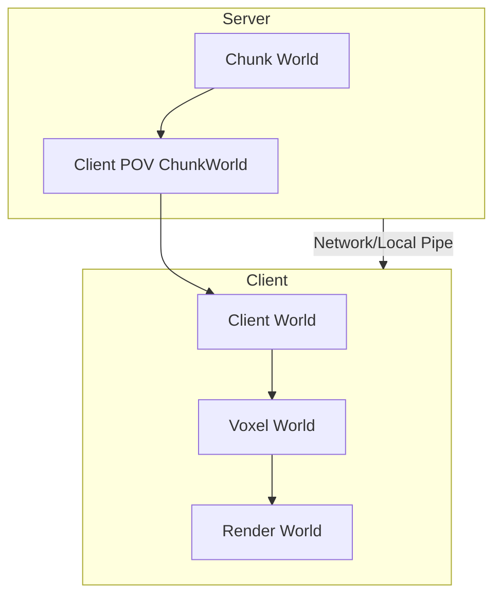

#  Worlds
## Introduction
To manage everything we abstract the game into multiple worlds.

```mermaid
flowchart TB
    server -- "Network/Local Pipe" --> client
    subgraph server [Server]
        direction LR
        chunk_world["Chunk World"] --> client_pov_chunk_world["Client POV ChunkWorld"]
    end
    subgraph client [Client]
        direction LR
        client_world["Client World"] --> voxel_world["Voxel World"]
        voxel_world --> render_world["Render World"]
    end
    client_pov_chunk_world --> client_world
    click voxel_world "#voxelworld"
```
### Clientside 
#### VoxelWorld {#voxelworld}